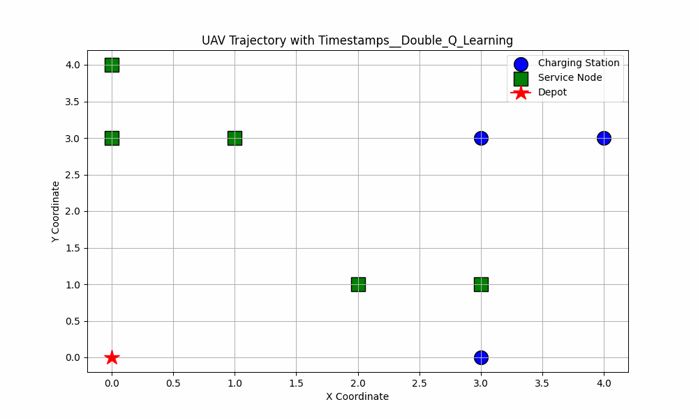
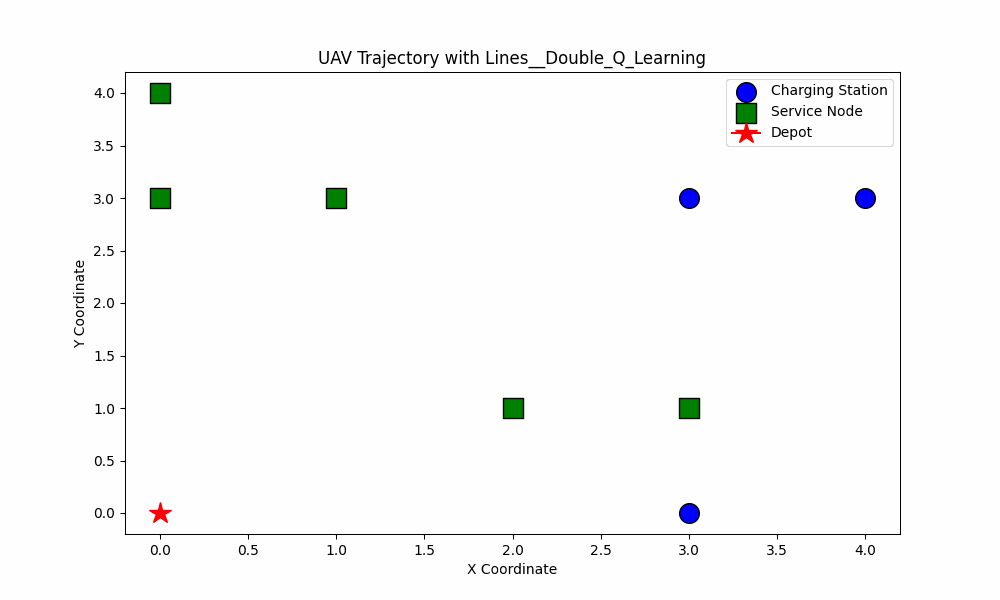
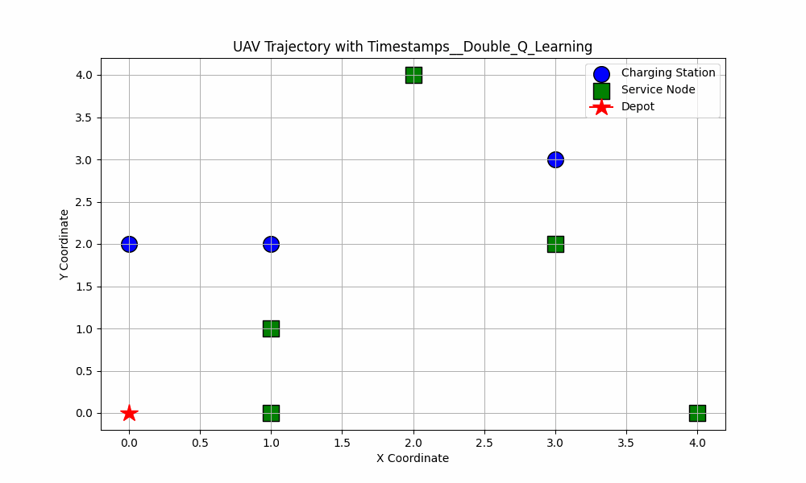
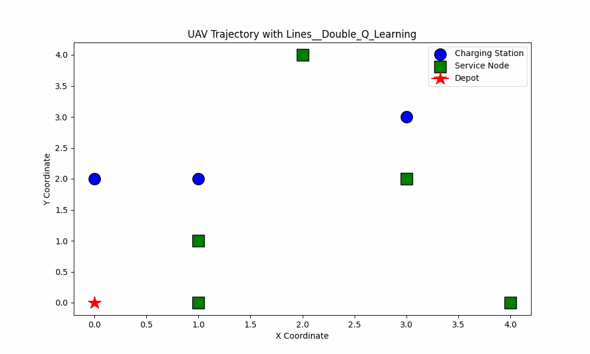

# Optimal UAV routing in presence of multiple charging stations

## Problem Description:

Objective: Minimize the total cost (distance traveled or time spent) of visiting a set of locations with UAVs, considering the necessity of recharging at multiple charging stations.

### Input:

Graph Representation: Represent the area of interest as a graph, where nodes represent locations that need to be visited, and edges represent the possible flight paths between locations.

#### Location Information: 
Each location has specific attributes such as demand, service time, and UAV charging requirements.

#### Charging Stations: 
Identify the locations of multiple charging stations in the area.

#### UAV Specifications: 
Consider UAV-specific characteristics, such as flight range, battery capacity, and charging time.

### Constraints:

#### UAV Range Constraint: 
UAVs have limited flight ranges, and the route must be planned within these constraints.

#### Charging Time Constraint: 
UAVs need to spend a certain amount of time at charging stations to replenish their batteries.

#### Service Time Constraint: 
Each location has a specific service time associated with it, representing the time required to perform a task or collect data.

### Decision Variables:

#### Routing Decision: 
Determine the optimal sequence of locations to be visited by each UAV.

#### Charging Decision: 
Decide when and where UAVs should recharge their batteries at the charging stations.

### Objective Function:

Minimize the total cost, which includes the sum of distances traveled between locations, the time spent servicing each location, and the time spent recharging at charging stations.

### Demostration of UAV routing using DQN algorithm

### Demostration of UAV routing using Double Q Learning algorithm

